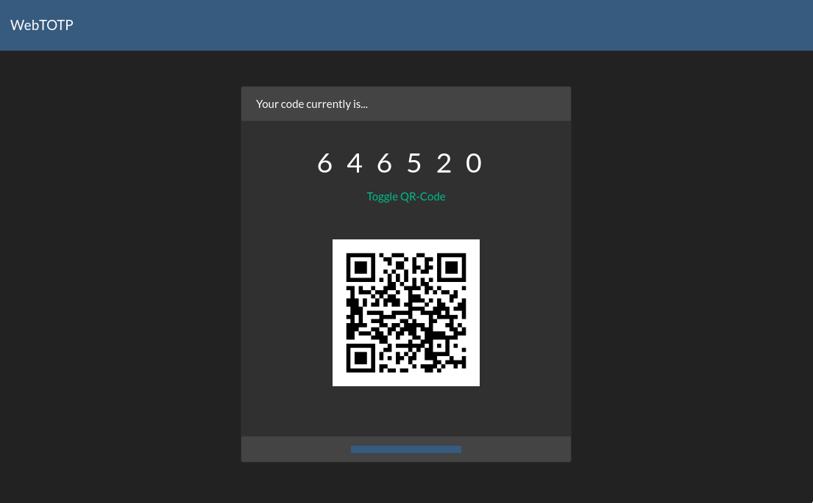

# Luzifer / webtotp

`webtotp` is a small web-based utility to create ad-hoc TOTP codes like the Google Authenticator would. The tool does not send any data to any service but is based fully in your browser.

My specific usecase for this is I do have accounts which OTP secrets are stored outside of my TOTP generator as usually I don't need to access those accounts and if I would add those secrets to my TOTP generator I would have a lot more entries in it. So I do store the secrets in a safe place and needed a convenient generator to generate single OTP tokens from them.

You can even send the page with the OTP code to someone by appending the secret to the URL in the hash part:
```
https://webtotp.example.com/#mysecret
```
As long as you make sure it is in the hash-part (behind the `#`) the browser will not send the secret to the server but keep it locally in the browser. When sending the URL containing the secret make sure you are using a secured transport like [OTS](https://ots.fyi/) to ensure the chat / email provider is not able to fetch those secrets from the URL.



## Installation

Either use the provided Docker image:

```console
# docker run --rm -ti -p 3000:3000 luzifer/webtotp
```

Or compile the code yourself and just put the generated files somewhere:

```console
# npm ci && npm run build
# tree dist
dist
├── app.js
└── index.html

0 directories, 2 files
```
